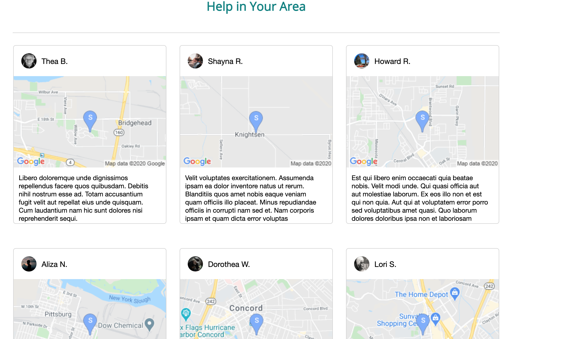
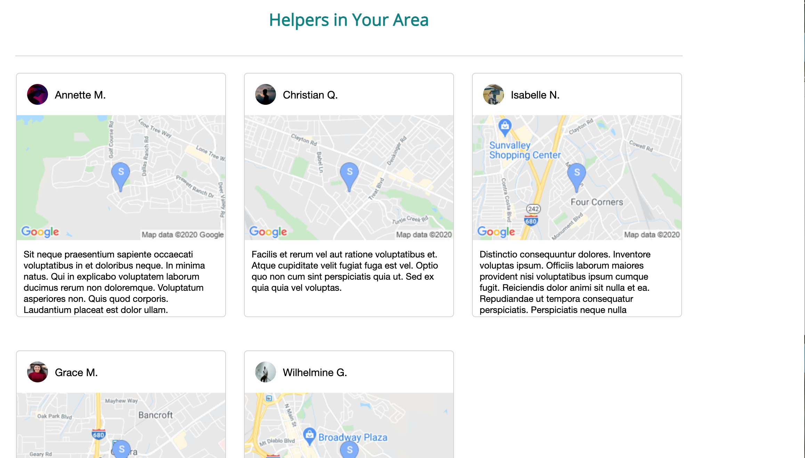

# help


> Welcome to help

help was created during the 2020 pandemic as a way to connect people who need help(helpees) with those who can help them out (helpers).  The app was designed especially for older people who may be limited in where they can go during the pandemic because of the risk of catching Covid-19.
Helpers can connect with local helpees in the area by searching their area or waiting for the page to dynamically load and display below on the homepage.  Each user can access the tasks they need to complete as helpers or can add a task to a list for helpees.  Tasks range from doing house chores to picking up groceries.

Users are designated as a helper or helpee and can use the google api services included to find and connect with them.

As a logged-in user, you will have access to:

* Tasks List (can be completed and assigned a helperId all with UI)
* SearchBar (can search for people or locations with both search bars)
* Giving Testimony (to be implemented in future upgrades)
* Giving helping hands (ratings for helpers or helpees)

(DISCLAIMER: This site is an App Academy project that is a light "clone" of the yelp.)

## Features

### Home Page

The Home Page will render a simple searchbar similar to yelp with a few links for accessibility navigating the site:


The Home Page also offers access to local users in the area which renders helpees within a 20 mile radius by using a geolocation service on the frontend to compare to the database which uses a node package to translate addresses to lattitude and longitude.  Everything then goes through a sorting algorhythm to render the nearest helper first, up to six helpers.



The Helpers are also rendered below this using the same sorting methods and routes on the backend.



### Searchbar

The searchbar was an interesting challenge as I tried to implement the best sorting algorhythm while also using a complex sequelize query that added users depending on location and/or a general search:

* Use possible multiple parameters to search location and general search(similar to yelp)

    To implement this, I used a react/redux store on the frontend which checked on the backend for a particular search.
    
    ```js
  export const localsFindLocation = (keyword) => async (dispatch) => {
    const { keywordSearch, locationSearch } = keyword;
    const res = await fetch('/api/search', {
      method: 'POST',
      body: JSON.stringify({
        keywordSearch,
        locationSearch
      }),
    })
    dispatch(findLocalsSearch(res.data.locals));
    return
  }
    ```

* On the backend use the search options to query the database using a complex sequelize query.  This was complicated at times as the sequelize syntax is a bit convoluted at points.

    ```js
    const { keywordSearch, locationSearch } = req.body;

    let locals;

    if (locationSearch) {
      let { lat, lng } = await geocodeAddress(locationSearch)
      lat = parseFloat(lat, 10)
      lng = parseFloat(lng, 10)
      locals = await User.findAll({
        where: {
          lat: {
            [Op.between]: [(lat - .5), (lat + .5)]
          },
          lng: {
            [Op.between]: [(lng - .5), (lng + .5)]
          },
          [Op.or]: [{
            username: {
              [Op.iLike]: '%' + keywordSearch + '%'
            }
          }, {
            firstName: {
              [Op.iLike]: '%' + keywordSearch + '%'
            }
          }, {
            lastName: {
              [Op.iLike]: '%' + keywordSearch + '%'
            }
          }]
        },
      })
    } else {
      locals = await User.findAll({
        where: {
          [Op.or]: [{username: {
            [Op.iLike]: '%'+keywordSearch+'%'
          }}, {firstName: {
            [Op.iLike]: '%'+keywordSearch+'%'
          }}, {lastName: {
            [Op.iLike]: '%'+keywordSearch+'%'
          }}]
        }
      })
    }

    if (locals.length === 0) {
      let err = 'No results found'
      return res.json({
        err,
      });
    }

    return res.json({
      locals,
      apiKey: process.env.GOOGLE_API,
    });
    
    ```


### Comments

* Access and leave comments on any story
* Comments dynamically update on your page after you publish, edit or delete them
* Comments slide into the screen and slide out

Comments functionality on the front-end were created with the use of the Fetch API to provide real-time site updates without the need for a page refresh.

Example: Dynamically editing a comment with Fetch

```js
const body = { comment };
try {
    const res = await fetch(`/stories/${storiesId}/comments/${commentId}`, {
        method: "PUT",
        body: JSON.stringify(body),
        headers: {
            "Content-Type": "application/json",
        },
    });
    if (!res.ok) {
        throw res;
    }
} catch (err) {
    alert("Something went wrong. Please try again!");
}
```
PostgreSQL utilization for database storage of all comments, available for any Fetch method request.

Example: Back-end routing established for accessing and deleting a comment from the database.

```js
router.delete('/:id(\\d+)', asyncHandler(async (req, res) => {
    const id = parseInt(req.params.id, 10);
    const comment = await Comment.findByPk(id);

    if (comment) {
        await comment.destroy();
        res.status(204).end();
    } else {
        const errors = validateErrors.array().map(error => error.msg);
        res.render('comments', {
            errors,
        });
    }
}));
```
There were some unique challenges with the comments, causing three of us to spend considerable time in various capacities on them. A number of insidious bugs were present in that last few days before deployment. Two big ones were the update of a comment `fetch` for a `PUT` (shown above) request was not *just* doing that, but also initiating *something* after one of the pushes suddenly causing a `GET` to immediately follow with an attached query string of what the newly revised comment was. It turned out that a key placement of `event.preventDefault()` was needed to fix that.

There was also some bug that was a combo: after *updating* the comment and/or *canceling* a delete, going through with a delete was causing "extra" deletions from the "Responses" count based on the number of times buttons were hit. This turned out to finally be solved (1) by unnesting some of the `addEventListener()` calls and (2) making those calls named functions and explicitly calling `removeEventListener()` on them when they were no longer needed.

## FAQ

### How can I write a story or leave a comment?

You will first need to sign-up for an account. Once you are logged in, you will have access to all features on the website, which include writing a story or leaving a comment.

### How can I follow my favorite writers?

See a story you like? You can click on the follow link at the top of any story page to begin following that writer.

### Why lightsabers?

Because they are cool.

## Links

Your destiny awaits... follow this link to enter Infinium:

https://infinium.herokuapp.com/

## Contributing

* Dale Sakamoto - DaleTsakamoto @ GitHub
* Michael Jensen - Mjensen24 @ GitHub
* Rhys Previte - Preezey24 @ GitHub
* Scott Smith - scottgit @ GitHub
